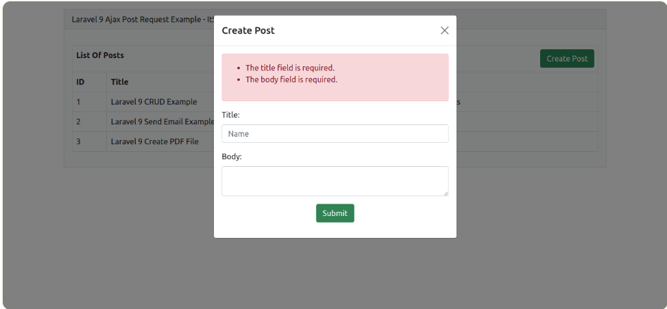

# laravel9_ajax_form_validation
## 1:Install Laravel 9:
```Dockerfile
composer create-project laravel/laravel laravel9_ajax_form_validation
```
## 2:Create Migration and Model
```Dockerfile
php artisan make:migration create_posts_table
```
- database/migrations/2022_02_17_133331_create_posts_table.php
```Dockerfile
<?php
  
use Illuminate\Database\Migrations\Migration;
use Illuminate\Database\Schema\Blueprint;
use Illuminate\Support\Facades\Schema;
  
return new class extends Migration
{
    /**
     * Run the migrations.
     *
     * @return void
     */
    public function up()
    {
        Schema::create('posts', function (Blueprint $table) {
            $table->id();
            $table->string('title');
            $table->text('body');
            $table->timestamps();
        });
    }
  
    /**
     * Reverse the migrations.
     *
     * @return void
     */
    public function down()
    {
        Schema::dropIfExists('posts');
    }
};
```
- Chạy terminal:
```Dockerfile
php artisan migrate
```
- Tạo model Post
```Dockerfile
php artisan make:model Post
```
- Vào app/Models/Post.php
```Dockerfile
<?php
  
namespace App\Models;
  
use Illuminate\Database\Eloquent\Factories\HasFactory;
use Illuminate\Database\Eloquent\Model;
  
class Post extends Model
{
    use HasFactory;
  
    /**
     * Write code on Method
     *
     * @return response()
     */
    protected $fillable = [
        'title', 'body'
    ];
}

```
## 3: Create Controller
- Tạo post Controller:
```Dockerfile
php artisan make:controller PostController
```
- Vào app/Http/Controllers/PostController.php
```Dockerfile
<?php 
  
namespace App\Http\Controllers;
  
use Illuminate\Http\Request;
use Illuminate\Support\Facades\Validator;
use App\Models\Post;
  
class PostController extends Controller
{
    /**
     * Write code on Method
     *
     * @return response()
     */
    public function index()
    {
        $posts = Post::get();
  
        return view('posts', compact('posts'));
    }
  
    /**
     * Write code on Method
     *
     * @return response()
     */
    public function store(Request $request)
    {
        $validator = Validator::make($request->all(), [
            'title' => 'required',
            'body' => 'required',
        ]);
  
        if ($validator->fails()) {
            return response()->json([
                        'error' => $validator->errors()->all()
                    ]);
        }
       
        Post::create([
            'title' => $request->title,
            'body' => $request->body,
        ]);
  
        return response()->json(['success' => 'Post created successfully.']);
    }
}
```
## 4:Create and Add Routes
-vào routes/web.php
```Dockerfile
<?php
  
use Illuminate\Support\Facades\Route;
  
use App\Http\Controllers\PostController;
  
/*
|--------------------------------------------------------------------------
| Web Routes
|--------------------------------------------------------------------------
|
| Here is where you can register web routes for your application. These
| routes are loaded by the RouteServiceProvider within a group which
| contains the "web" middleware group. Now create something great!
|
*/
  
Route::controller(PostController::class)->group(function(){
    Route::get('posts', 'index');
    Route::post('posts', 'store')->name('posts.store');
});
```
## 5:Create Blade File
- Vào resources/views/posts.blade.php
```Dockerfile
<!DOCTYPE html>
<html>
<head>
    <title>Laravel 9 Ajax Post Request Example - ItSolutionStuff.com</title>
    <link href="https://cdn.jsdelivr.net/npm/bootstrap@5.0.2/dist/css/bootstrap.min.css" rel="stylesheet">
    <script src="https://cdn.jsdelivr.net/npm/bootstrap@5.0.2/dist/js/bootstrap.bundle.min.js" integrity="sha384-MrcW6ZMFYlzcLA8Nl+NtUVF0sA7MsXsP1UyJoMp4YLEuNSfAP+JcXn/tWtIaxVXM" crossorigin="anonymous"></script>
    <script src="https://cdnjs.cloudflare.com/ajax/libs/jquery/3.6.0/jquery.min.js" ></script>
    <meta name="csrf-token" content="{{ csrf_token() }}" />
</head>
<body>
     
<div class="container">
    <div class="card bg-light mt-3">
        <div class="card-header">
            Laravel 9 Ajax Post Request Example - ItSolutionStuff.com
        </div>
        <div class="card-body">
  
            <table class="table table-bordered mt-3">
                <tr>
                    <th colspan="3">
                        List Of Posts
                        <button type="button" class="btn btn-success float-end" data-bs-toggle="modal" data-bs-target="#postModal">
                          Create Post
                        </button>
                    </th>
                </tr>
                <tr>
                    <th>ID</th>
                    <th>Title</th>
                    <th>Body</th>
                </tr>
                @foreach($posts as $post)
                <tr>
                    <td>{{ $post->id }}</td>
                    <td>{{ $post->title }}</td>
                    <td>{{ $post->body }}</td>
                </tr>
                @endforeach
            </table>
  
        </div>
    </div>
</div>
  
<!-- Modal -->
<div class="modal fade" id="postModal" tabindex="-1" aria-labelledby="exampleModalLabel" aria-hidden="true">
  <div class="modal-dialog">
    <div class="modal-content">
      <div class="modal-header">
        <h5 class="modal-title" id="exampleModalLabel">Create Post</h5>
        <button type="button" class="btn-close" data-bs-dismiss="modal" aria-label="Close"></button>
      </div>
      <div class="modal-body">
        <form >
  
            <div class="alert alert-danger print-error-msg" style="display:none">
                <ul></ul>
            </div>
    
            <div class="mb-3">
                <label for="titleID" class="form-label">Title:</label>
                <input type="text" id="titleID" name="name" class="form-control" placeholder="Name" required="">
            </div>
  
            <div class="mb-3">
                <label for="bodyID" class="form-label">Body:</label>
                <textarea name="body" class="form-control" id="bodyID"></textarea>
            </div>
     
            <div class="mb-3 text-center">
                <button class="btn btn-success btn-submit">Submit</button>
            </div>
    
        </form>
      </div>
    </div>
  </div>
</div>
     
</body>
  
<script type="text/javascript">
      
    $.ajaxSetup({
        headers: {
            'X-CSRF-TOKEN': $('meta[name="csrf-token"]').attr('content')
        }
    });
  
    $(".btn-submit").click(function(e){
    
        e.preventDefault();
     
        var title = $("#titleID").val();
        var body = $("#bodyID").val();
     
        $.ajax({
           type:'POST',
           url:"{{ route('posts.store') }}",
           data:{title:title, body:body},
           success:function(data){
                if($.isEmptyObject(data.error)){
                    alert(data.success);
                    location.reload();
                }else{
                    printErrorMsg(data.error);
                }
           }
        });
    
    });
  
    function printErrorMsg (msg) {
        $(".print-error-msg").find("ul").html('');
        $(".print-error-msg").css('display','block');
        $.each( msg, function( key, value ) {
            $(".print-error-msg").find("ul").append('<li>'+value+'</li>');
        });
    }
  
</script>
  
</html>
```
## 6: Run Laravel App:
```Dockerfile
php artisan serve
```
- Vào http://localhost:8000/posts



